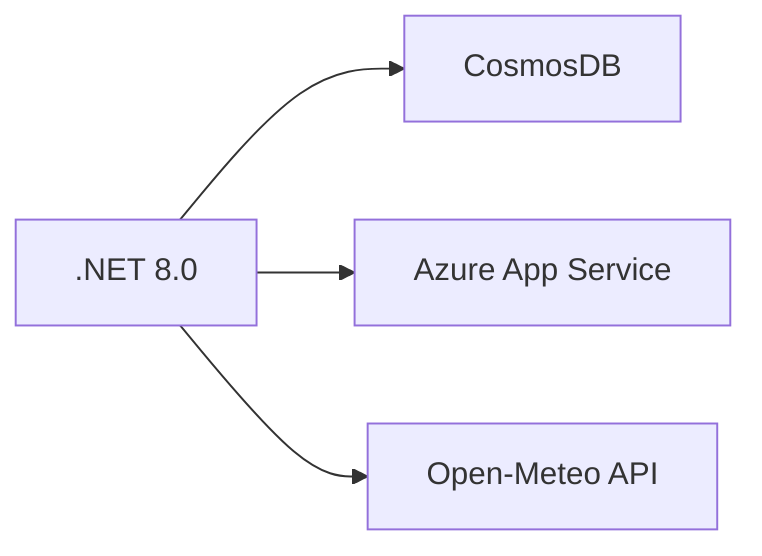
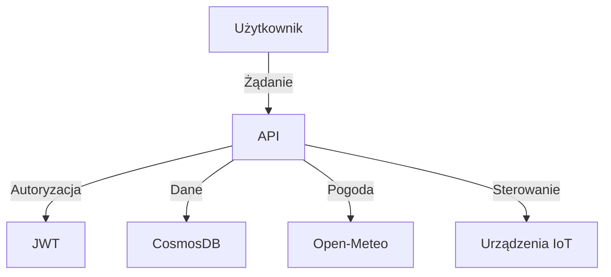

## AgroSense API - Inteligentny system monitorowania i sterowania nawadnianiem

### **Przegląd projektu**

AgroSense to system IoT dla rolnictwa precyzyjnego, łączący monitorowanie warunków glebowych (wilgotność, temperatura) z funkcjami sterowania nawadnianiem. Aplikacja oparta na architekturze .NET 8.0 wykorzystuje CosmosDB do przechowywania danych historycznych i integruje się z zewnętrznymi API pogodowymi. Hostowana na Azure, zapewnia zdalny dostęp do danych i funkcji sterowania.

### **Założenia biznesowe**

1. **Optymalizacja zużycia wody**: Redukcja kosztów nawadniania o 30-40% poprzez precyzyjne sterowanie oparte na danych czujników
2. **Zapobieganie stratom**: System alertów przy spadku wilgotności poniżej progów krytycznych minimalizuje ryzyko uszkodzeń upraw
3. **Raporty decyzyjne**: Historyczne dane umożliwiają analizę trendów i planowanie inwestycji
4. **Zdalne sterowanie**: Mobilny dostęp do funkcji nawadniania z dowolnej lokalizacji

### **Technologie**




### **Konfiguracja środowiska**

#### Plik `appsettings.json`

```json
{
  "CosmosDB": {
    "Endpoint": "mongodb://<user>:<pass>@cluster0.mongodb.net",
    "DbName": "AgroSenseDB"
  },
  "Jwt": {
    "Key": "min_128_bit_secure_key",
    "Issuer": "AgroSenseAPI"
  },
  "UserAuth": {
    "Login": "admin",
    "Pass": "strong_password"
  }
}
```


### **Endpointy API**

| Metoda | Ścieżka | Funkcjonalność | Autoryzacja | Przykładowa odpowiedź |
| :-- | :-- | :-- | :-- | :-- |
| `GET` | `/api/main/humidity` | Aktualna wilgotność gleby | Nie | `{"humidity": 65, "advice": "Watering"}` |
| `GET` | `/api/main/history` | Historia pomiarów wilgotności | Tak | `[{"humidity": 60, "dateUtc": "2025-06-27T12:00:00Z"}]` |
| `POST` | `/api/main/history?humidity=65` | Zapis pomiaru wilgotności | Tak | `202 Accepted` |
| `GET` | `/api/main/weather` | Dane pogodowe dla Lisse | Nie | `Obecna temperatura: 22°C, wiatr: 5m/s` |
| `POST` | `/api/main/start-watering` | Uruchomienie nawadniania | Tak | `Nawodnienie rozpoczęte` |
| `POST` | `/api/main/stop-watering` | Zatrzymanie nawadniania | Tak | `Nawodnienie zakończone` |
| `POST` | `/api/main/login` | Generowanie tokenu JWT | Nie | `eyJhbGciOiJIUzI1NiIsInR5cCI6IkpXVCJ9...` |

### **User Stories**

1. **Jako rolnik**:
    - Chcę widzieć aktualną wilgotność gleby na dashboardzie → Endpoint `/api/main/humidity`
    - Chcę uruchomić nawadnianie z poziomu telefonu → Endpoint `POST /api/main/start-watering`
2. **Jako administrator**:
    - Chcę przeglądać historyczne trendy → Endpoint `/api/main/history`

### **Rozwiązywanie problemów**

| Problem | Rozwiązanie |
| :-- | :-- |
| `401 Unauthorized` | Sprawdź poprawność tokenu JWT w nagłówku `Authorization: Bearer <token>` |
| `NullReferenceException` | Zainicjalizuj właściwości modeli: `public Current current { get; set; } = new();` |

### **Bezpieczeństwo**

   - Dostęp do poszczególnych funkcji API po zalogowaniu
   - Operowanie na szyfrowanych tokenach dostępu



